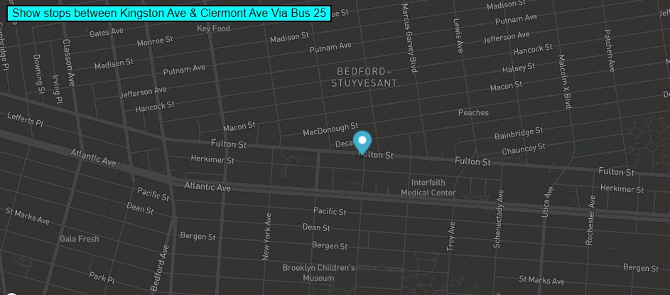

<a href="https://github.com/TennWilliams/Bus-Tracker"> Bus Tracker Exercise </a>
# How Many Stops Do I Have?

In this exercise I used a map API of the Brooklyn MTA bus to show the locations (cooridinates) of the B25 bus.  I displayed a night time map with a starting marker between Fulton Street and Kingston Ave.  Then when you click the button the marker moves from the start point, Kingston Ave, along the B25 route via Fulton Street until you get to Clermont Ave.

## Future improvments 
I would like to make it a live bus tracker to show the location of the bus in real time.

## Run Code
To run this code you must clone this code in VS code and then open the HTML file in a web broswer.

License through MIT
